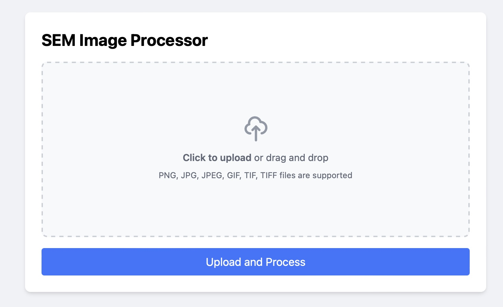

# SEM Image Crop Tool

## Overview

The SEM Image Crop tool is a web-based application designed to process Scanning Electron Microscope (SEM) images of periodic silicon 2D structures. This tool allows users to upload TIFF images, select specific regions of interest, apply transformations, and extract exact boundaries of structures within the image.

## Features

- Upload and process SEM images
- Interactive image transformation based on user-selected points
- Precise boundary marking with polygon drawing tools
- Image processing to extract and highlight specific structures
- Download processed images in PNG format

## Installation

### Prerequisites

- Python 3.7 or higher
- pip (Python package manager)

### Setup

1. Clone the repository:

   ```
   git clone https://github.com/yourusername/sem-image-processor.git
   cd sem-image-processor
   ```
2. Create a virtual environment (optional but recommended):

   ```
   python -m venv venv
   source venv/bin/activate  # On Windows, use `venv\Scripts\activate`
   ```
3. Install the required packages:

   ```
   pip install -r requirements.txt
   ```

## Usage

1. Start the Flask application:

   ```
   python app.py
   ```
2. Open a web browser and navigate to `http://localhost:5000`
3. Upload an SEM image

   
4. Select four points on the image to define the region of interest

   
5. Click "Apply Transform" to process the selected region
6. Use the drawing tools to mark the boundaries of structures in the image

   
7. Click "Process Image" to extract the marked structures
8. Download the processed image using the "Download Result" button

## Contributing

Contributions to improve the SEM Image Processor are welcome. Please follow these steps:

1. Fork the repository
2. Create a new branch (`git checkout -b feature/AmazingFeature`)
3. Commit your changes (`git commit -m 'Add some AmazingFeature'`)
4. Push to the branch (`git push origin feature/AmazingFeature`)
5. Open a Pull Request

## License

Distributed under the MIT License. See `LICENSE` file for more information.

## Contact

Tianxiang Dai - txdai@stanford.edu

Project Link: https://github.com/txdai/SEM-Crop-Tool
